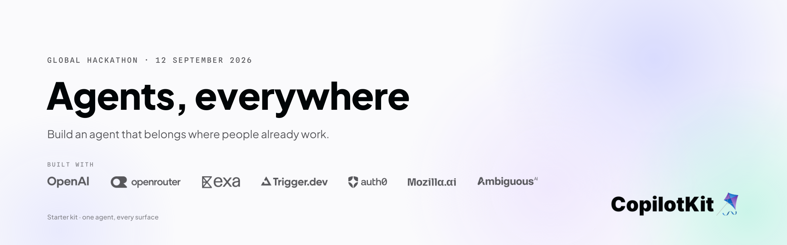

<div align="center">

# Agents, Everywhere — Starter Kit



Slack and Teams out of the box, one agent behind every surface, and no tunnel.

[Quickstart](#run-it-locally) · [The Context Ladder](#the-context-ladder) · [Stack](#stack) · [dev-docs](dev-docs/) · [Submission checklist](SUBMISSION.md)

</div>

---

## About this starter

Built for **[Agents, Everywhere: Bots, Channels, & More](https://aitinkerers.org/hackathons/global/agents-everywhere)** — the AI Tinkerers global hackathon with OpenAI, Saturday 12 September 2026, 51 cities, one global submission pool.

The build window is **11:15–15:30**. That is **255 minutes**, and every decision in this kit follows from it:

- **One credential gets you a running agent.** No Docker, no Postgres, no second process.
- **Zero tunnel for Slack.** No ngrok, no public URL of your own, no app-level token.
- **Six surfaces, so you can pick one.** Terminal, Slack, web, voice, ChatGPT and mobile all run the *same* agent. Take one and go deep — see [Pick one surface](#pick-one-surface).
- **A pre-flight check that fails loudly**, with a numbered list of exactly what to fix.

Everything here is meant to be gutted. Keep the plumbing, throw away the demo.

---

## The Context Ladder

The challenge is not "build a bot." It is: *make it meaningfully more useful **because of that context**.* That is a ladder, and it climbs.

|   | Level | The agent… | The test |
|---|---|---|---|
| **1** | **Reachable** | is addressable where you already are — mention it, it answers | Table stakes. Every submission in every city clears this. |
| **2** | **Situated** | reads the surface's context without being told — thread history, the doc you're in, who's asking, what happened an hour ago | Delete the context and ask again. Same answer? You're still on rung 1. |
| **3** | **Native** | acts and renders in the surface's own idioms — Block Kit cards, approval buttons, reactions, notifications — and its side effects land where the work lives | Does it look like it belongs, or like a chat window wearing a costume? |

Rung 3 is where a global review separates submissions. This kit ships working code for all three: `read_thread` for rung 2, `brief_card` / `comparison_table` for rung 3, and `confirm_action` for the approval gate that makes an agent trustworthy enough to leave in a channel.

---

## Pick one surface

The event is explicit: **"a sharp, working demo beats a broad concept."** This kit
ships six surfaces so you can choose the one your idea actually belongs in — not
so you can build all six. A team that demos six half-finished surfaces loses to a
team that demos one that genuinely belongs somewhere.

So: **pick one, go deep, and use a second only as the closing beat of your video.**

| If your idea lives… | Start here | Why this one |
|---|---|---|
| where a team argues about something | `apps/channel-slack` | The thread is already the record. Highest ceiling, lowest setup — no tunnel. |
| in a tool someone stares at all day | `apps/web` | Generative UI: the agent operates the app, not just talks about it. |
| in a room, hands busy | `apps/web/voice` | Realtime over WebRTC. The only surface where latency *is* the product. |
| inside ChatGPT itself | `apps/mcp` | Distribution you don't have to build. Verified against the live protocol. |
| in a pocket, between things | `apps/mobile` | Notifications and one-tap approvals beat another chat app. |

Two honest cautions before you choose:

- **`apps/mobile` is the least proven** — it installs and typechecks, but nobody
  has run it on a device. Don't pick it at 11:15 and discover that at 15:00.
- **Voice punishes slow tools.** If your agent needs `deep` research, it will feel
  broken out loud. Exa's `instant` profile exists for this.

The other surfaces still boot, so a second one is nearly free — that is what makes
"and it also works on my phone" a ten-second closing shot rather than a second
project.

---

## Run it locally

### Tier 0 — one credential, ~5 minutes

```bash
npm install
cp .env.example .env      # paste an OPENAI_API_KEY
npm run dev
```

With no Channel configured yet, `npm run dev` starts the **terminal surface** — the same agent, sub-second loop, no Slack round trip. Use it to tune the prompt before you wire anything up.

> `npm run dev` runs a pre-flight check first. It fails with a numbered list of missing keys, a malformed Channel Code, or a Node version too old for Channels. Fix what it lists and re-run. `npm run check-env` any time.

### Tier 1 — the agent lives in Slack, ~15 minutes

```bash
npm run channel:setup
```

That installs a skill, prints a prompt, and copies it to your clipboard — paste it into Claude Code or Cursor and it drives the Slack and Intelligence consoles in your own signed-in session. You type the secrets; it does the clicking.

By hand, in this order (**the order matters** — the Channel wizard generates the Slack app manifest, so creating the app first means creating the wrong app):

```bash
npx copilotkit@latest channels add --name my-agent \
  --display-name "My Agent" --adapter slack --json
```

Then put the Channel **Code** in `CHANNEL_CODE`, a project-scoped key in `INTELLIGENCE_API_KEY`, and run `npm run dev` again. In Slack: `/invite @yourbot`, then @-mention it.

Full walkthrough: **[dev-docs/setup.md](dev-docs/setup.md)**. Stuck: **[dev-docs/troubleshooting.md](dev-docs/troubleshooting.md)**.

### Verify it

```bash
npm run verify
```


Typechecks all six packages, runs the component and safety tests, and drives the
MCP server over the **real protocol** — initialize, tools/list, tools/call,
resources/read. No credentials needed for any of it. It also names the three
things it cannot prove, rather than implying they passed.

### Requirements

**Node.js 22+** — Channels needs global `WebSocket`. `nvm use` reads `.nvmrc`. Tier 1 needs a CopilotKit Intelligence project (free tier); there is no DIY path, because Intelligence owns the platform credentials and delivery.

---

## How it fits together

```
packages/agent-core        ONE agent. Model, prompt, capabilities.
  src/agent.ts               BuiltInAgent by default — swap for LangGraph, CrewAI,
                             Mastra, Pydantic AI or Google ADK by returning an
                             HttpAgent instead. Nothing else changes.
  src/model.ts               OpenAI by default; one env var flips it to OpenRouter.
  src/prompt.ts              How to behave inside someone else's workspace.
  src/shared.ts              The browser-safe surface — prompt, schemas, notes.
  src/capabilities/          Surface-agnostic implementations (Exa search).

apps/local-chat            your terminal        — tier 0, one credential
apps/channel-slack         Slack / Teams        — Channels, zero tunnel
  src/channel.tsx            createChannel + handlers
  src/components.tsx         agent-rendered native cards (rung 3)
  src/tools.tsx              read_thread, search_web, confirm_action
  src/durable.tsx            run_deep_work — the two-tier approval
  src/server.ts              lifecycle — and why `ready()` is not proof of life
apps/web                   the browser          — generative UI + /voice
apps/mcp                   ChatGPT / Claude     — MCP server with a UI widget
apps/durable               Trigger.dev          — work that outlives a chat turn
apps/mobile                iOS / Android        — Expo, standalone (see below)
```

Every surface imports the same `makeAgent`. That is the whole point of [AG-UI](https://docs.copilotkit.ai): the agent does not know or care which surface it is talking through.

Two deliberate exceptions, both documented where they live: **voice** cannot run `BuiltInAgent` because Realtime is a different model family, so it shares the prompt and capabilities instead; and **mobile** is not an npm workspace member, because React Native pins its own `react` and hoisting that can break the web app.

### Why Slack needs no tunnel

```
Slack ──HTTPS, signed with a secret Intelligence holds──▶ CopilotKit Intelligence
                                                                    │
                          outbound websocket, authed by your key    ▼
                                                            your local process
```

You never expose a port. The cost is that your process must be **long-running** — a Channels listener cannot live in a serverless handler. See [dev-docs/deploy.md](dev-docs/deploy.md).

---

## Stack

7 of these are **wired** — real code you can read, delete, or build on. 2 are
**referenced** — named because they fit, with an honest note on what integrating
them would take. The distinction is marked on each heading, because a logo on a
banner is not an integration.


### CopilotKit — Channels SDK · **wired**

[Channels](https://github.com/CopilotKit/channels-sdk) brings any AG-UI agent into Slack, Microsoft Teams, Discord, Telegram, and WhatsApp with **native, interactive UI** — one JSX tree renders as Slack Block Kit or Teams Adaptive Cards, and a surface that cannot render a node skips it instead of failing. Intelligence manages the platform credentials and delivery; your agent, tools, and business logic stay yours.

Pinned here as a tested pair: `@copilotkit/channels@0.9.2` + `@copilotkit/runtime@1.70.3`. Bump them together.

[More about Channels →](https://docs.copilotkit.ai/slack) · [CopilotKit docs →](https://docs.copilotkit.ai)

### CopilotKit — React & React Native · **wired**

The same agent needs a frontend on every surface it lands on, and both come from
CopilotKit rather than being hand-rolled.

**Web** — `@copilotkit/react-core@1.70.1`. `apps/web` uses `CopilotKitProvider`,
`CopilotSidebar`, `useComponent` (controlled generative UI), `useHumanInTheLoop`
(the approval gate), `useFrontendTool` and `useAgentContext`. Worth knowing: the
V2 surface lives at `@copilotkit/react-core/v2` — `@copilotkit/react-ui` is the V1
surface and this kit does not need it.

**Mobile** — `@copilotkit/react-native@1.70.1`. `apps/mobile` is an Expo app on the
same agent: headless provider, a hand-rolled chat screen, and the same
`propose_action` approval contract as Slack and web, so the agent behaves
identically on a phone.

Four things about the React Native SDK that the docs do not tell you, all verified
against the published 1.70.1 bundles:

- **Import from `@copilotkit/react-native/headless`, never the root barrel.** The
  root entry imports `expo-document-picker` and `expo-file-system`
  unconditionally; the headless subpath imports none of the optional native
  peers, so the app needs no Metro stubs at all.
- **`index.js` import order is load-bearing.** `react-native-get-random-values`
  first (otherwise CopilotKit installs a `Math.random()` crypto shim and warns it
  is not secure), then `@copilotkit/react-native/polyfills`, then the app — the
  barrel overrides `global.fetch` and React Native's `InitializeCore` clobbers it
  if imported too early.
- **One polyfill import is enough on 1.70.1.** The barrel now installs streams,
  encoding, crypto, DOMException and location plus streaming fetch. Older
  versions only did streaming-fetch and needed all five granular subpaths.
- **Render tool calls through `useRenderToolCall()`.** It resolves the renderer
  *and* supplies `respond`, which is what makes an approval card answerable.
  Walking the render registry by hand is a trap: the local `useRenderTool`
  registry passes only `{ args, status }` with no `respond`, so the card renders
  perfectly and silently cannot be answered.

`apps/mobile` is deliberately **not** an npm workspace member — React Native pins
its own `react` and `react-native`, and hoisting those can break `apps/web`. It
installs and runs on its own.

> Installs, resolves and typechecks with Expo-blessed versions (SDK 54, RN 0.81.5,
> react 19.1.0). **Not run on a device** — that is the one surface here nobody has
> launched. See `apps/mobile/README.md`.

[React Native quickstart →](https://docs.copilotkit.ai/react-native) · [CopilotKit reference →](https://docs.copilotkit.ai/reference)

### OpenAI · **wired**

The default model provider. The kit runs on **`gpt-5.6-sol`**, with **`gpt-6-astra`** a one-line change away when a build needs the hardest end-to-end reasoning — and `gpt-5.6-luna` a one-line change the other way if hackathon credits start running out.

Also behind two of the surfaces here: the **Realtime API** (`gpt-realtime-2.1` over WebRTC) drives `/voice`, and the **plugins** model — an MCP server plus skills plus optional UI — is what `apps/mcp` implements for agents living inside ChatGPT itself.

[Models →](https://developers.openai.com/api/docs/models) · [Realtime →](https://developers.openai.com/api/docs/guides/realtime) · [Plugins →](https://developers.openai.com/plugins/)

### OpenRouter · **wired**

An AI gateway across hundreds of models, with cost-optimized routing and provider fallbacks. In this kit it is **live-demo insurance**: set `OPENROUTER_API_KEY` and the whole agent re-routes with no other change. If OpenAI rate-limits you at 14:00 with a demo at 15:30, that is the line that saves the day.

[More about OpenRouter →](https://openrouter.ai/docs/quickstart)

### Exa · **wired**

Search built for agents, and the grounding layer for every surface here. The detail that matters: Exa's search types are a **latency dial**, and `instant` (~250ms) / `fast` (~450ms) are the only sane choices inside a chat thread — `deep-reasoning` can take 40 seconds and reads as a hung bot. The kit defaults to `fast` and the pre-flight check warns if you pick a slow one.

`search_web` is only registered when `EXA_API_KEY` is present; without it the agent is told plainly that it has no web access rather than guessing.

[More about Exa →](https://exa.ai/docs) · hosted MCP at `mcp.exa.ai/mcp`

### Trigger.dev · **wired**

Open-source background jobs in plain async code — queuing, retries, elastic scaling. Its **waitpoint tokens** are the natural partner to a Channels approval gate: a button click completes a `wait.forToken()`, and the task resumes to do work that outlives the chat turn.

Wired up in `apps/durable` and exposed to Slack as the `run_deep_work` tool. See [dev-docs/durable-work.md](dev-docs/durable-work.md).

[More about Trigger.dev →](https://trigger.dev/docs/quick-start)

### Auth0 · **referenced**

Identity for agents: **Token Vault** so the agent calls third-party APIs as *the asking user* rather than a service account, **CIBA** for out-of-band approval on someone's phone, and **FGA** for document-level access control in RAG. The natural escalation above an in-thread button.

**Not integrated.** `apps/durable/src/approvals.ts` is the seam and it throws
deliberately: the CIBA flow is clear (POST `/bc-authorize` → `auth_req_id` → poll
`/oauth/token`) but the parameter set and polling error codes are not in the
overview docs, and a plausible guess there 400s for reasons nobody can see. The
Trigger.dev waitpoint is already waiting — completing it from an Auth0 callback
changes nothing else in the chain.

[More about Auth0 for AI Agents →](https://auth0.com/ai/docs)

### Mozilla.ai · **referenced**

`any-llm` (one interface across providers), `any-agent` (one interface across seven agent frameworks, plus OpenTelemetry traces and agent-as-a-judge evaluation), and **`mcpd`** — "requirements.txt for agentic systems", a daemon that manages MCP servers from declarative config. All open source.

**Not integrated, and worth knowing why.** `mcpd` looked like the natural fit —
one declarative file for the agent's MCP servers, working the same locally and in
a container. But it exposes servers as **REST** (`/api/v1/servers/{server}/tools/{tool}`),
not over the MCP protocol, so it is not a drop-in for `mcpServers` and would need
a real adapter. `any-llm` and `any-agent` are Python and would fight a
TypeScript-first kit.

If you are building in Python, invert that: `any-agent` behind an AG-UI endpoint
and every surface here works unchanged. Its graded traces are an underrated demo
asset — showing *why* the agent did what it did lands harder than showing that it
worked.

[More about Mozilla.ai →](https://www.mozilla.ai/open-tools/choice-first-stack)

### Ambiguous AI · **wired**

A workspace of 17 productivity apps — Docs, Mail, Sheets, Chat, CRM, Calendar, Tasks and more — where AI coworkers hold their own identity and work on the same data as the team. Free for teams of five.

The fastest *at work* integration available, because there is no admin consent screen and no per-object sharing dance:

```bash
npx ambiguous auth signup --name "My Agent" --human-email you@example.com
```

Wired as an MCP server in `packages/agent-core/src/capabilities/workplace.ts`, so
the on-call agent can file the follow-up task and send the summary itself instead
of telling a human to. Set `AMBIGUOUS_API_KEY` and the tools appear; leave it
unset and the agent is never offered them.

> Written against the documented MCP surface and typechecked, but **not run
> against a live workspace** — that needs a key. Ten minutes to prove.

[More about Ambiguous AI →](https://www.ambiguous.ai/)

---

## Vibe coding

Skills are pre-installed. Open the repo in Claude Code or Cursor and they are picked up automatically.

```
.agents/skills/      ← one copy
.claude/skills   →   symlink
.cursor/skills   →   symlink
```

`build-channels-agent` carries the **verified** Channels API surface plus a "common mistakes" list — the most common failure mode when writing Channels code with an LLM is inventing a plausible-looking API, and that skill is the antidote. [AGENTS.md](AGENTS.md) holds the repo-specific rules that are easy to get wrong (the `@ag-ui/client` dedupe pin, `jsxImportSource`, `maxSteps`).

`.mcp.json` wires the CopilotKit docs MCP server and Exa's hosted MCP into your coding agent, so it can look things up live:

```
https://mcp.copilotkit.ai/mcp     https://mcp.exa.ai/mcp
```

To pull the rest of the CopilotKit skills:

```bash
npx skills add copilotkit/skills --full-depth -y
```

---

## Where to go next

Honest status. What ships works and is typechecked; the rest is scaffolding you or your team can add.

| Surface | Status |
|---|---|
| Terminal (tier 0) | **working** — reaches the model, verified |
| Slack (managed Channel) | **working** — boots to real Channel activation; needs your Intelligence project to prove the round trip |
| Microsoft Teams | swap `--adapter teams`; same JSX renders as Adaptive Cards |
| Web — Next.js + generative UI | **working** — `next build` passes, `useComponent` / HITL / frontend tools wired |
| Voice — OpenAI Realtime over WebRTC | **working** — ephemeral client secrets, `gpt-realtime-2.1` |
| ChatGPT / Claude / Codex — MCP server | **working** — verified against the live protocol: initialize, tools/list, tools/call, resources/read |
| Trigger.dev durable work + waitpoint approval | **wired** — typechecked; needs a Trigger.dev project to run |
| Mobile — Expo + `@copilotkit/react-native` | **scaffolded** — installs, Expo-aligned, typechecks; **not** device-verified |
| Ambiguous AI workplace (mail / tasks / CRM over MCP) | **wired** — typechecked; needs a key to prove against a live workspace |
| Auth0 CIBA out-of-band approval | **referenced** — deliberately a throwing stub, not a guess |
| Mozilla.ai | **referenced** — `mcpd` is REST, not MCP protocol, so it needs an adapter |
| Discord / Telegram / WhatsApp | adapters ship in `@copilotkit/channels`; not wired here |

Everything marked *working* was exercised, not just compiled. The two that are not
say so, and `apps/mobile/README.md` and `apps/durable/src/approvals.ts` explain
exactly what is left.

This is a menu, not a checklist. See [Pick one surface](#pick-one-surface).

**The two-tier approval is already built**, minus its last mile. `confirm_action`
gates cheap things with an in-thread button that blocks the tool. `run_deep_work`
handles the expensive ones: it creates a Trigger.dev waitpoint, hands the job to a
durable task that parks on it, and posts an approval card — so the thread stays
live while a job that outlives the conversation waits on a human. Approve, and the
task wakes up and works. The remaining step is routing that same waitpoint through
an Auth0 CIBA push instead of a channel button, for the actions where "somebody
clicked in Slack" is not a strong enough claim about who approved it.

---

## Documentation

- **[Setup](dev-docs/setup.md)** · **[Channels](dev-docs/channels.md)** · **[Surfaces](dev-docs/surfaces.md)**
- **[Tools, native UI & approval gates](dev-docs/tools-and-context.md)** · **[Model switching](dev-docs/model-switching.md)**
- **[Deploy](dev-docs/deploy.md)** · **[Demo prompts](dev-docs/demo-prompts.md)** · **[Troubleshooting](dev-docs/troubleshooting.md)**
- **[SUBMISSION.md](SUBMISSION.md)** — the five deliverables as a checklist
- **[CREDITS.md](CREDITS.md)** — sponsor credits, to fill in at the opening session
- **[research/](research/)** — the sponsor-by-sponsor research this kit was built from, including verified package versions and a teardown of the previous hackathon kit

## License

MIT.

---

<div align="center">
<sub>Built for <b>Agents, Everywhere: Bots, Channels, &amp; More</b> — 12 September 2026.</sub>
</div>
